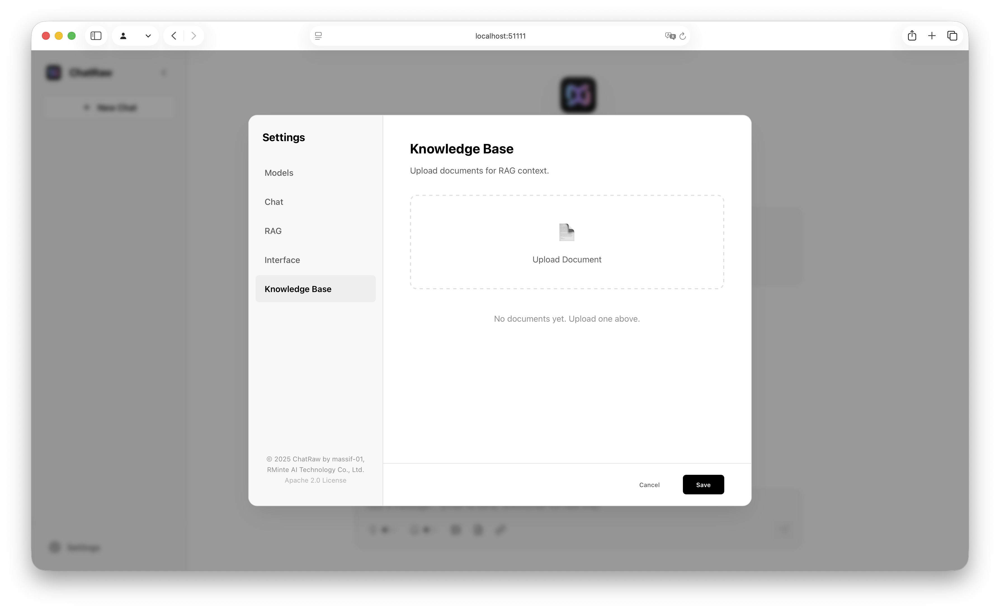

<div align="center">

# ChatRaw 🚀

**Minimalist AI Chat Interface | 极简 AI 聊天界面**

*30s deployment, zero registration, any OpenAI-compatible API*


[English](#-why-chatraw) / [中文](#-为什么选择-chatraw)

</div>

---

## 💡 Why ChatRaw?

Existing open-source chat frontends are too heavy and complex. Many developers and AI hardware vendors simply need a clean, ready-to-use, minimal chat tool that supports any OpenAI-compatible API, allows drag-and-drop document RAG, requires zero registration, and can be deployed with one click — to demo their AI hardware or local models to clients in 30 seconds.

**ChatRaw was born for this.**

## ✨ Features

- 🪶 **Ultra Lightweight** - ~50MB memory, optimized binary embedding storage
- ⚡ **Instant Startup** - Ready in seconds, connection pooling for fast API calls
- 🎨 **Custom Branding** - Freely change name and logo
- 🔌 **Plug & Play** - Any OpenAI-compatible API (Ollama, vLLM, LocalAI, LM Studio, etc.)
- 📄 **Drag & Drop RAG** - Upload documents (PDF, DOCX, TXT, MD) for instant Q&A
- 🔗 **URL Parser** - Parse web pages and use content as AI context
- 🖼️ **Vision AI** - Multimodal image understanding
- 🌍 **i18n** - English & Chinese with one-click switch
- 🔒 **Zero Registration** - Settings auto-saved locally
- 🐳 **One-Click Deploy** - Docker in 30 seconds, multi-arch (AMD64/ARM64)

## 🚀 Quick Start

**Option 1: One Command**
```bash
docker run -d -p 51111:51111 -v chatraw_data:/app/data --name chatraw massif01/chatraw:latest
```

**Option 2: Docker Compose**
```bash
git clone https://github.com/massif-01/ChatRaw.git
cd ChatRaw
docker compose up -d
```

**Option 3: From Source**
```bash
git clone https://github.com/massif-01/ChatRaw.git
cd ChatRaw/backend
pip install -r requirements.txt
python main.py
```

**Visit http://localhost:51111**

## 🔄 Update

**Option 1: Docker (One Command)**
```bash
# Pull latest image
docker pull massif01/chatraw:latest

# Stop and remove old container
docker stop chatraw && docker rm chatraw

# Start new container (data is preserved in volume)
docker run -d -p 51111:51111 -v chatraw_data:/app/data --name chatraw massif01/chatraw:latest
```

**Option 2: Docker Compose**
```bash
cd ChatRaw

# Pull latest code
git pull origin main

# Rebuild and restart
docker compose down
docker compose pull
docker compose up -d
```

**Option 3: From Source**
```bash
cd ChatRaw

# Pull latest code
git pull origin main

# Update dependencies
cd backend
pip install -r requirements.txt

# Restart the server
python main.py
```

> 💡 **Note**: Your settings and uploaded documents are preserved during updates. The data is stored in Docker volume (`chatraw_data`) or `data/` folder.

## 🎨 Interface

| Light Mode | Dark Mode |
|:----------:|:---------:|
|  |  |

## 📸 Feature Screenshots

### 1. Model Settings
Configure your AI models with any OpenAI-compatible API endpoint.


### 2. Chat Settings
Adjust temperature, top_p and other model hyperparameters.


### 3. RAG Settings
Configure chunk size, overlap, top_k and score threshold for document retrieval.


### 4. Interface Settings
Customize theme, language, logo, subtitle and avatars.


### 5. Knowledge Base
Upload and manage documents for RAG-powered Q&A.



---

## 💡 为什么选择 ChatRaw？

现有的开源聊天前端都太重太复杂了。很多开发者和 AI 硬件厂商其实只需要一个干净、开箱即用、支持任意 OpenAI 兼容 API、还能随便拖个文档就 RAG、零注册、一键部署的极简聊天工具，30秒给客户展示你的 AI 硬件/本地模型。

**ChatRaw 就是为此而生。**

## ✨ 特性

- 🪶 **极致轻量** - 内存占用 ~50MB，二进制向量存储优化
- ⚡ **极速启动** - 秒级启动，连接池加速 API 调用
- 🎨 **自定义品牌** - 随意更改名称和 LOGO
- 🔌 **即插即用** - 支持任意 OpenAI 兼容 API（Ollama、vLLM、LocalAI、LM Studio 等）
- 📄 **拖拽 RAG** - 支持 PDF、DOCX、TXT、MD 文档上传问答
- 🔗 **网页解析** - 解析网页内容作为 AI 上下文辅助回答
- 🖼️ **视觉理解** - 支持多模态模型图片理解
- 🌍 **多语言** - 中英文一键切换
- 🔒 **零注册** - 无需登录，设置自动保存到本地
- 🐳 **一键部署** - Docker 30秒部署，多架构支持 (AMD64/ARM64)

## 🚀 快速开始

**方式一：一行命令**
```bash
docker run -d -p 51111:51111 -v chatraw_data:/app/data --name chatraw massif01/chatraw:latest
```

**方式二：Docker Compose**
```bash
git clone https://github.com/massif-01/ChatRaw.git
cd ChatRaw
docker compose up -d
```

**方式三：源代码部署**
```bash
git clone https://github.com/massif-01/ChatRaw.git
cd ChatRaw/backend
pip install -r requirements.txt
python main.py
```

**访问 http://localhost:51111**

## 🔄 更新

**方式一：Docker（一行命令）**
```bash
# 拉取最新镜像
docker pull massif01/chatraw:latest

# 停止并删除旧容器
docker stop chatraw && docker rm chatraw

# 启动新容器（数据保存在 volume 中不会丢失）
docker run -d -p 51111:51111 -v chatraw_data:/app/data --name chatraw massif01/chatraw:latest
```

**方式二：Docker Compose**
```bash
cd ChatRaw

# 拉取最新代码
git pull origin main

# 重建并重启
docker compose down
docker compose pull
docker compose up -d
```

**方式三：源代码部署**
```bash
cd ChatRaw

# 拉取最新代码
git pull origin main

# 更新依赖
cd backend
pip install -r requirements.txt

# 重启服务
python main.py
```

> 💡 **提示**：更新过程中您的设置和上传的文档都会保留。数据存储在 Docker volume（`chatraw_data`）或 `data/` 文件夹中。

## 🎨 界面展示

| 浅色模式 | 深色模式 |
|:-------:|:-------:|
|  |  |

## 📸 功能截图

### 1. 模型设置
配置您的 AI 模型，支持任意 OpenAI 兼容 API 端点。


### 2. 聊天设置
调整 temperature、top_p 等模型超参数。


### 3. RAG 设置
配置文档检索的分块大小、重叠、Top K 和相似度阈值。


### 4. 界面设置
自定义主题、语言、Logo、副标题和头像。


### 5. 知识库管理
上传和管理文档，实现基于 RAG 的智能问答。


---

## 📝 API Compatibility | API 兼容性

| Service | URL Example |
|---------|-------------|
| Ollama | `http://localhost:11434/v1` |
| vLLM | `http://localhost:8000/v1` |
| LocalAI | `http://localhost:8080/v1` |
| LM Studio | `http://localhost:1234/v1` |
| OpenAI | `https://api.openai.com/v1` |

---

## 🔧 v1.4.0 Performance Optimizations | 性能优化

**Backend:**
- HTTP connection pooling (30-50% faster API calls) | HTTP 连接池复用 (API 调用快 30-50%)
- SQLite indexes for faster queries | SQLite 索引加速查询
- Binary embedding storage (30% smaller DB) | 二进制向量存储 (数据库体积减少 30%)
- Paginated RAG retrieval (50% less memory) | RAG 分页加载 (内存减少 50%)

**Frontend:**
- System fonts (no external requests) | 系统字体 (无外部请求)
- Optimized highlight.js (~50KB vs ~500KB) | 精简代码高亮 (~50KB vs ~500KB)
- PDF & DOCX document parsing support | 支持 PDF、DOCX 文档解析

---

## 📄 License

[Apache License 2.0](https://www.apache.org/licenses/LICENSE-2.0)

Copyright © 2025 massif-01, RMinte AI Technology Co., Ltd.

---

<div align="center">

**ChatRaw** - Making AI Chat Simple Again

</div>
