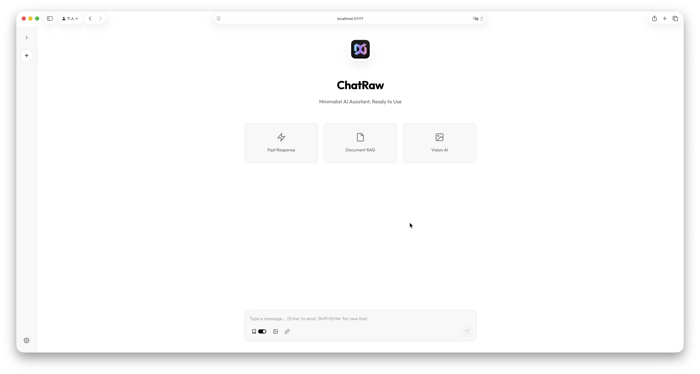

<div align="center">

# ChatRaw 🚀

**Minimalist AI Chat Interface | 极简 AI 聊天界面**



*30s deployment, zero registration, any OpenAI-compatible API*


[English](#-why-chatraw) / [中文](#-为什么选择-chatraw)

</div>

---

## 💡 Why ChatRaw?

Existing open-source chat frontends are too heavy and complex. Many developers and AI hardware vendors simply need a clean, ready-to-use, minimal chat tool that supports any OpenAI-compatible API, allows drag-and-drop document RAG, requires zero registration, and can be deployed with one click — to demo their AI hardware or local models to clients in 30 seconds.

**ChatRaw was born for this.**

## ✨ Features

- 🪶 **Ultra Lightweight** - <50MB memory usage
- ⚡ **Instant Startup** - Ready in seconds
- 🔌 **Plug & Play** - Any OpenAI-compatible API (Ollama, vLLM, LocalAI, LM Studio, etc.)
- 📄 **Drag & Drop RAG** - Upload documents for instant Q&A
- 🖼️ **Vision AI** - Multimodal image understanding
- 🌍 **i18n** - English & Chinese with one-click switch
- 🔒 **Zero Registration** - Settings auto-saved locally
- 🐳 **One-Click Deploy** - Docker in 30 seconds

## 🚀 Quick Start

**Option 1: One Command**
```bash
docker run -d -p 51111:51111 -v chatraw_data:/app/data --name chatraw massif01/chatraw:latest
```

**Option 2: Git Clone**
```bash
git clone https://github.com/massif-01/ChatRaw.git
cd ChatRaw
docker compose up -d
```

**Visit http://localhost:51111**

---

## 💡 为什么选择 ChatRaw？

现有的开源聊天前端都太重太复杂了。很多开发者和 AI 硬件厂商其实只需要一个干净、开箱即用、支持任意 OpenAI 兼容 API、还能随便拖个文档就 RAG、零注册、一键部署的极简聊天工具，30秒给客户展示你的 AI 硬件/本地模型。

**ChatRaw 就是为此而生。**

## ✨ 特性

- 🪶 **极致轻量** - 内存占用 <50MB
- ⚡ **极速启动** - 秒级启动
- 🔌 **即插即用** - 支持任意 OpenAI 兼容 API（Ollama、vLLM、LocalAI、LM Studio 等）
- 📄 **拖拽 RAG** - 拖个文档进来就能问答
- 🖼️ **视觉理解** - 支持多模态模型图片理解
- 🌍 **多语言** - 中英文一键切换
- 🔒 **零注册** - 无需登录，设置自动保存到本地
- 🐳 **一键部署** - Docker 30秒部署

## 🚀 快速开始

**方式一：一行命令**
```bash
docker run -d -p 51111:51111 -v chatraw_data:/app/data --name chatraw massif01/chatraw:latest
```

**方式二：克隆仓库**
```bash
git clone https://github.com/massif-01/ChatRaw.git
cd ChatRaw
docker compose up -d
```

**访问 http://localhost:51111**

---

## 📝 API Compatibility | API 兼容性

| Service | URL Example |
|---------|-------------|
| Ollama | `http://localhost:11434/v1` |
| vLLM | `http://localhost:8000/v1` |
| LocalAI | `http://localhost:8080/v1` |
| LM Studio | `http://localhost:1234/v1` |
| OpenAI | `https://api.openai.com/v1` |

---

## 📄 License

[Apache License 2.0](https://www.apache.org/licenses/LICENSE-2.0)

Copyright © 2025 massif-01, RMinte AI Technology Co., Ltd.

---

<div align="center">

**ChatRaw** - Making AI Chat Simple Again

</div>
